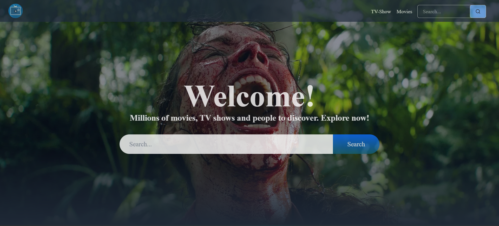

# 🎬 BINGER - Movies & TV Shows Streaming Application

A modern, feature-rich streaming platform built with React and Vite that allows users to explore, search, and discover movies and TV shows with detailed information, cast details, video trailers, and more.

 <!-- Replace with actual screenshot -->


## 📋 Table of Contents

- [Features](#features)
- [Tech Stack](#tech-stack)
- [Prerequisites](#prerequisites)
- [Installation & Setup](#installation--setup)
- [Environment Configuration](#environment-configuration)
- [Running the Application](#running-the-application)
- [Build for Production](#build-for-production)
- [Project Structure](#project-structure)
- [Key Components & Pages](#key-components--pages)
- [API Integration](#api-integration)
- [Development Scripts](#development-scripts)

---

## ✨ Features

### Core Features

- 🏠 **Home Page** - Dynamic banner with trending content and featured movies/shows
- 🔍 **Search Functionality** - Search movies and TV shows by title/keywords
- 📊 **Browse Categories** - Explore Trending, Popular, and Top Rated content
- 📺 **Media Explorer** - Filter and browse content by media type (Movies/TV Shows)
- 🎬 **Detailed Media Pages** - Comprehensive information including:
  - Poster and backdrop images
  - Synopsis and overview
  - Rating and review information
  - Release date and runtime
  - Genres
- 👥 **Cast & Crew Information** - View cast members and crew details
- 🎥 **Video Trailers & Clips** - Watch embedded trailers and video content
- 🎞️ **Media Player** - Built-in video player for movies and TV shows
- 🔄 **Recommendations** - Get personalized recommendations based on selected media
- 📝 **Similar Content** - Discover similar movies/shows
- 🎨 **Responsive Design** - Fully responsive UI that works on desktop, tablet, and mobile
- ⚡ **Performance Optimized** - Fast loading with lazy loading images
- 🎭 **Rating Circles** - Visual rating indicators for media items
- 📱 **Modern UI Components** - Built with Shadcn UI components and Radix UI

---

## 🛠️ Tech Stack

### Frontend Framework & Build Tool

- **React** (v18.3.1) - UI library for building user interfaces
- **Vite** (v6.0.1) - Next generation frontend build tool with HMR (Hot Module Replacement)
- **React Router DOM** (v7.0.2) - Client-side routing and navigation

### State Management

- **Redux Toolkit** (v2.4.0) - Predictable state management
- **React Redux** (v9.1.2) - Official React bindings for Redux

### Styling & UI Components

- **Tailwind CSS** (v3.4.15) - Utility-first CSS framework
- **Shadcn UI** - High-quality, accessible React components
- **Radix UI** - Unstyled, accessible primitives for building design systems
  - @radix-ui/react-accordion (v1.2.1)
  - @radix-ui/react-dropdown-menu (v2.1.2)
  - @radix-ui/react-tabs (v1.1.2)
- **Class Variance Authority** (v0.7.1) - CSS class composition
- **Tailwind Merge** (v2.5.5) - Merge Tailwind CSS classes
- **CLSX** (v2.1.1) - Utility for constructing className strings
- **Tailwindcss Animate** (v1.0.7) - Animation utilities for Tailwind

### Carousel & Media Components

- **Embla Carousel React** (v8.5.1) - Carousel/slider component
- **React Player** (v2.16.0) - Video player component
- **React Circular Progressbar** (v2.1.0) - Circular progress indicator
- **React Lazy Load Image Component** (v1.6.2) - Lazy loading for images

### Icons & Utilities

- **Lucide React** (v0.462.0) - Beautiful icon library
- **React Icons** (v5.4.0) - Popular icon sets as React components
- **DayJS** (v1.11.13) - Lightweight date library
- **React Select** (v5.9.0) - Accessible select component
- **Axios** (v1.7.9) - HTTP client for API requests

### Development Tools

- **ESLint** (v9.15.0) - Code quality and linting
- **Tailwind CSS** - Plugin support with PostCSS
- **PostCSS** (v8.4.49) - CSS transformations
- **Autoprefixer** (v10.4.20) - Vendor prefixes for CSS

---

## 📋 Prerequisites

Before you begin, ensure you have the following installed on your machine:

- **Node.js** (v16 or higher)
- **npm** (v7 or higher) or **yarn**
- **Git** (for version control)
- **TMDB API Key** (free account from [themoviedb.org](https://www.themoviedb.org))

---

## 🚀 Installation & Setup

### Step 1: Clone the Repository

```bash
git clone https://github.com/SR22kl/Binger.git
cd Binger
```

### Step 2: Install Dependencies

Using npm:

```bash
npm install
```

Or using yarn:

```bash
yarn install
```

### Step 3: Create Environment Configuration

Create a `.env.local` file in the root directory:

```bash
VITE_APP_TMDB_TOKEN=your_tmdb_api_token_here
```

### Step 4: Verify Installation

Check that all dependencies are installed correctly:

```bash
npm list
```

---

## 🔑 Environment Configuration

### Setting Up TMDB API Token

1. **Create a TMDB Account**
   - Visit [themoviedb.org](https://www.themoviedb.org)
   - Click "Sign Up" and create a free account
   - Verify your email address

2. **Generate API Key**
   - Log in to your TMDB account
   - Go to Settings → API
   - Create a new API key (v3 auth token)
   - Copy the API token and save it securely

3. **Configure Environment Variable**
   - Create `.env.local` file in project root
   - Add your token:
     ```
     VITE_APP_TMDB_TOKEN=your_token_here
     ```

4. **Security Note**
   - Never commit `.env.local` to version control
   - Add `.env.local` to `.gitignore`
   - Keep your API key confidential

---

## 🏃 Running the Application

### Development Mode

Start the development server with hot module replacement:

```bash
npm run dev
```

The application will be available at `http://localhost:5173`

### Production Preview

Build for production and preview locally:

```bash
npm run build
npm run preview
```

---

## 🏗️ Build for Production

### Create Production Build

```bash
npm run build
```

This generates an optimized build in the `dist` folder with:

- Minified JavaScript and CSS
- Code splitting for better performance
- Asset optimization
- Source maps for debugging

### Deploying the Build

The `dist` folder is ready to be deployed to any static hosting service:

- Vercel
- Netlify
- GitHub Pages
- AWS S3 + CloudFront
- Azure Static Web Apps

---

## 📁 Project Structure

```
Binger/
├── public/                 # Static assets
├── src/
│   ├── assets/            # Project assets (images, icons, etc.)
│   ├── components/        # Reusable UI components
│   │   ├── ui/           # Shadcn UI & primitive components
│   │   │   ├── accordion.jsx
│   │   │   ├── button.jsx
│   │   │   ├── card.jsx
│   │   │   ├── carousel.jsx
│   │   │   ├── dropdown-menu.jsx
│   │   │   ├── input.jsx
│   │   │   ├── pagination.jsx
│   │   │   ├── skeleton.jsx
│   │   │   └── tabs.jsx
│   │   ├── Banner.jsx              # Homepage banner component
│   │   ├── Carousel.jsx            # Carousel slider
│   │   ├── ContentWrapper.jsx      # Layout wrapper component
│   │   ├── DetailSkeleton.jsx      # Loading skeleton for details
│   │   ├── Genres.jsx              # Genre filter component
│   │   ├── LazyImag.jsx            # Lazy loading image component
│   │   ├── MediaCard.jsx           # Media item card
│   │   ├── Navbar.jsx              # Navigation bar
│   │   ├── PaginationEx.jsx        # Pagination component
│   │   ├── PopularTab.jsx          # Popular items tab
│   │   ├── RatingCircle.jsx        # Circular rating display
│   │   ├── SkeletonCard.jsx        # Skeleton loader for cards
│   │   ├── Spinner.jsx             # Loading spinner
│   │   ├── SwitchTabs.jsx          # Tab switcher (Movie/TV)
│   │   ├── VideoPopUp.jsx          # Video modal popup
│   │   └── ...other components
│   ├── hook/               # Custom React hooks
│   │   └── useFetch.jsx    # Custom hook for API data fetching
│   ├── pages/              # Page components
│   │   ├── Home.jsx        # Homepage
│   │   ├── Details.jsx     # Media details page
│   │   ├── DetailsBanner.jsx       # Details page banner
│   │   ├── Explore.jsx     # Explore/browse page
│   │   ├── Search.jsx      # Search results page
│   │   ├── Cast.jsx        # Cast information
│   │   ├── VideoSection.jsx        # Video trailers section
│   │   ├── Similar.jsx     # Similar media section
│   │   ├── Recommendation.jsx      # Recommendations section
│   │   ├── Trending.jsx    # Trending media
│   │   ├── Popular.jsx     # Popular media
│   │   ├── TopRated.jsx    # Top rated media
│   │   ├── MediaPlayer.jsx # Movie player
│   │   ├── MediaPlayerTv.jsx       # TV episode player
│   │   ├── Footer.jsx      # Footer component
│   │   ├── PageNotFound.jsx        # 404 page
│   │   └── ...other pages
│   ├── store/              # Redux store setup
│   │   ├── Store.js        # Redux store configuration
│   │   └── homeSlice.js    # Redux slice for home state
│   ├── lib/                # Utility libraries
│   │   └── utils.js        # Helper utilities
│   ├── utils/              # Utility functions
│   │   └── api.js          # API service with Axios
│   ├── App.jsx             # Root component
│   ├── main.jsx            # Entry point
│   └── index.css           # Global styles
├── .env.local              # Environment variables (not in git)
├── .gitignore              # Git ignore file
├── components.json         # Shadcn UI configuration
├── eslint.config.js        # ESLint configuration
├── jsconfig.json           # JavaScript configuration
├── package.json            # Project dependencies
├── postcss.config.js       # PostCSS configuration
├── tailwind.config.js      # Tailwind CSS configuration
├── vite.config.js          # Vite configuration
└── index.html              # HTML entry point
```

---

## 🧩 Key Components & Pages

### Components

- **Navbar** - Navigation bar with search functionality
- **Banner** - Hero banner with featured content
- **MediaCard** - Reusable media item card displaying poster, title, and rating
- **Carousel** - Horizontal carousel using Embla Carousel
- **RatingCircle** - Circular progress indicator for ratings
- **SkeletonCard** - Skeleton loading state for smooth UX
- **Spinner** - Loading spinner indicator
- **SwitchTabs** - Toggle between Movies and TV Shows
- **VideoPopUp** - Modal for video playback
- **Genres** - Genre filter component
- **PaginationEx** - Pagination for browsing paginated content

### Pages

- **Home** - Shows trending, popular, and top-rated content
- **Details** - Comprehensive media information with cast, videos, and recommendations
- **Explore** - Browse and filter content by type and genre
- **Search** - Search results for movies and TV shows
- **MediaPlayer** - Video player for movies
- **MediaPlayerTv** - Video player for TV episodes
- **Trending** - Trending media section
- **Popular** - Popular media section
- **TopRated** - Top-rated media section
- **Cast** - Cast member details and filmography
- **Similar** - Similar media recommendations
- **Recommendation** - Personalized recommendations
- **VideoSection** - Trailers and video clips
- **Footer** - Footer with links and information
- **PageNotFound** - 404 error page

---

## 🔌 API Integration

### API Service

The application uses **The Movie Database (TMDB) API** for all data.

**Base URL:** `https://api.themoviedb.org/3`

### Key API Endpoints Used

- `/configuration` - Get image base URLs
- `/genre/{type}/list` - Get available genres
- `/{mediaType}/{id}/videos` - Get videos and trailers
- `/{mediaType}/{id}/credits` - Get cast and crew information
- `/{mediaType}/{id}/similar` - Get similar media
- `/{mediaType}/{id}/recommendations` - Get recommendations
- `/trending/{type}/week` - Get trending content
- `/{type}/popular` - Get popular content
- `/{type}/top_rated` - Get top-rated content
- `/search/{type}` - Search movies/shows

### Error Handling

The API service includes:

- Automatic error catching and logging
- Proper HTTP header configuration with authentication
- Support for custom parameters

---

## 📝 Development Scripts

```bash
# Start development server with HMR
npm run dev

# Build for production
npm run build

# Preview production build locally
npm run preview

# Run ESLint to check code quality
npm run lint

# Fix ESLint errors (if configured)
npm run lint -- --fix
```

---

## 🎨 Styling & Customization

### Tailwind CSS

The project uses Tailwind CSS for rapid UI development. Configure it in `tailwind.config.js`:

- Dark mode support is enabled
- Custom color variables are defined
- Border radius utilities are customized

### Shadcn UI

Accessible, beautiful components are available in `src/components/ui/`:

- Fully customizable components
- Built on Radix UI primitives
- Uses Tailwind CSS for styling

---

## 🔒 Security Best Practices

1. **API Key Protection**
   - Store API keys in `.env.local`
   - Never commit sensitive data to git
   - Rotate keys regularly

2. **Dependencies**
   - Keep dependencies updated regularly
   - Run `npm audit` to check for vulnerabilities
   - Review security alerts from npm

3. **CORS**
   - API requests go through TMDB's secure endpoints
   - No sensitive data stored in localStorage without encryption

---

## 🚦 Getting Started Quick Guide

1. **Clone & Install**

   ```bash
   git clone https://github.com/SR22kl/Binger.git
   cd Binger
   npm install
   ```

2. **Setup Environment**

   ```bash
   # Create .env.local file with TMDB API token
   echo "VITE_APP_TMDB_TOKEN=your_token" > .env.local
   ```

3. **Run Development Server**

   ```bash
   npm run dev
   ```

4. **Open Browser**
   - Navigate to `http://localhost:5173`
   - Explore movies and TV shows!

---

## 📦 Deployment Options

### Vercel (Recommended)

```bash
npm i -g vercel
vercel
```

### Netlify

```bash
npm i -g netlify-cli
netlify deploy --prod --dir=dist
```

### GitHub Pages

Configure vite.config.js with `base: '/Binger/'` and use GitHub Actions

---

## 🤝 Contributing

1. Fork the repository
2. Create a feature branch (`git checkout -b feature/amazing-feature`)
3. Commit your changes (`git commit -m 'Add amazing feature'`)
4. Push to the branch (`git push origin feature/amazing-feature`)
5. Open a Pull Request

---

## 📄 License

This project is open source and available under the MIT License.

---

## 🐛 Troubleshooting

### Common Issues

**Issue: API returns 401 Unauthorized**

- Verify TMDB API token is correct in `.env.local`
- Check token hasn't expired in TMDB account

**Issue: Images not loading**

- Ensure API configuration is fetched correctly
- Check image base URL from TMDB configuration API

**Issue: Port 5173 already in use**

```bash
# Use different port
npm run dev -- --port 3000
```

**Issue: Dependencies conflicts**

```bash
# Clear node_modules and reinstall
rm -rf node_modules package-lock.json
npm install
```

---

## 📞 Support & Feedback

For bugs, feature requests, or feedback:

- Open an issue on GitHub
- Contact the development team
- Check existing issues before opening a new one

---


**Happy Coading! 🎬🍿**